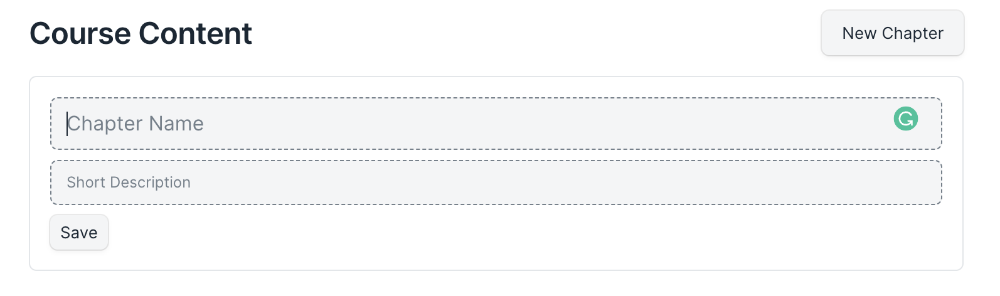

# Chapter

A chapter forms the second layer in the LMS hierarchy. It is used to group lessons that belong to a certain topic.

Once the user saves the course, they will see a Course Content section at the bottom. From there, users can add chapters to their courses. Add the following information to your chapter:

 - **Chapter Name:** Add a title to your chapter.
 - **Short Description:** Provide a one-line description for your chapter.

After entering these details, you can save the chapter.

