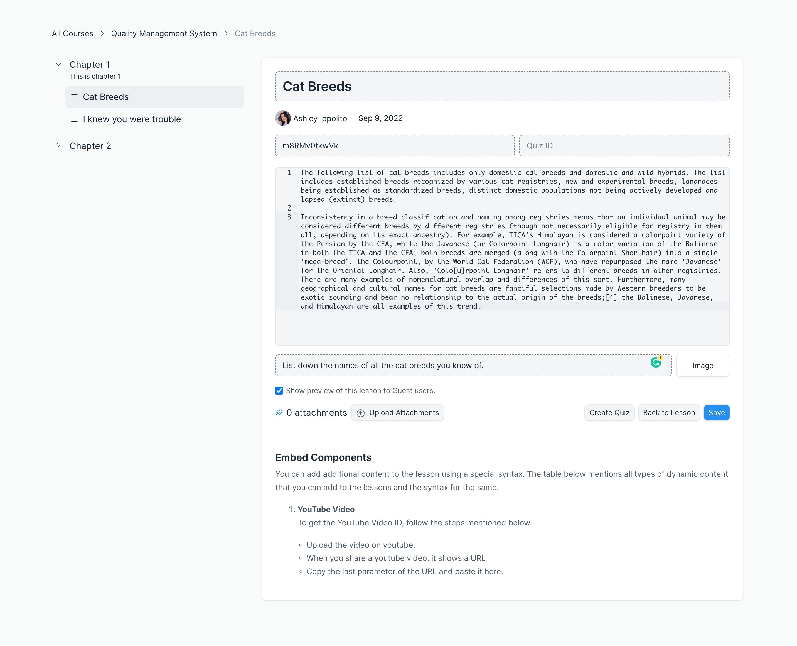

# Lesson

When a user saves a chapter, they will see a button **New Lesson** below the chapter. To create a new lesson, a user can click on this button. This will take them to the lesson page.

To create a lesson, a user will have to enter the following details on the lesson page:

 - **Title:** Add a title for the lesson.
 - **YouTube Video ID:** If you want to add a YouTube video to the lesson, you can add its ID to this field. To obtain the video ID, follow the steps mentioned [here](../miscellaneous/faq.md#how-to-add-youtube-video-in-a-lesson-or-for-course-preview).
 - **Quiz ID:** If you want to add a quiz to your lesson, you can add its ID to this field. To create a quiz, follow the steps mentioned [here](../course-creation/create-a-quiz.md).
 - **Content:** In the text editor, enter the main content of the lesson.
 - **Assignment Question:** If you want to add an assignment to the lesson, you can add the question of the assignment here.
 - **File Type:** Beside this you can select the file type in which you want users to submit this assignment. There are 3 supported file types: Image, Document, and PDF.
 - **Show preview of this lesson to Guest users:** If you want Guest users to be able to see this lesson without enrolling for the course, just to get a preview, you can enable this option.

 ::: tip Add Images and Videos
 To add images to the lesson you can use the **Upload Attachments** button. From the modal that appears you can add any image and video from your local computer to the lesson. Once uploaded you can click on the attachment count and copy the attachment. Then paste this in the content editor field where you want to add it.
 :::

After entering all the details, you can save the lesson.