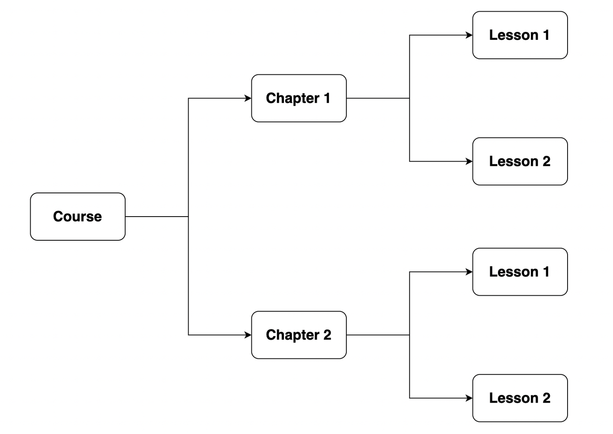
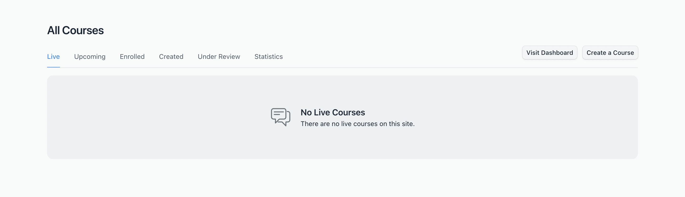
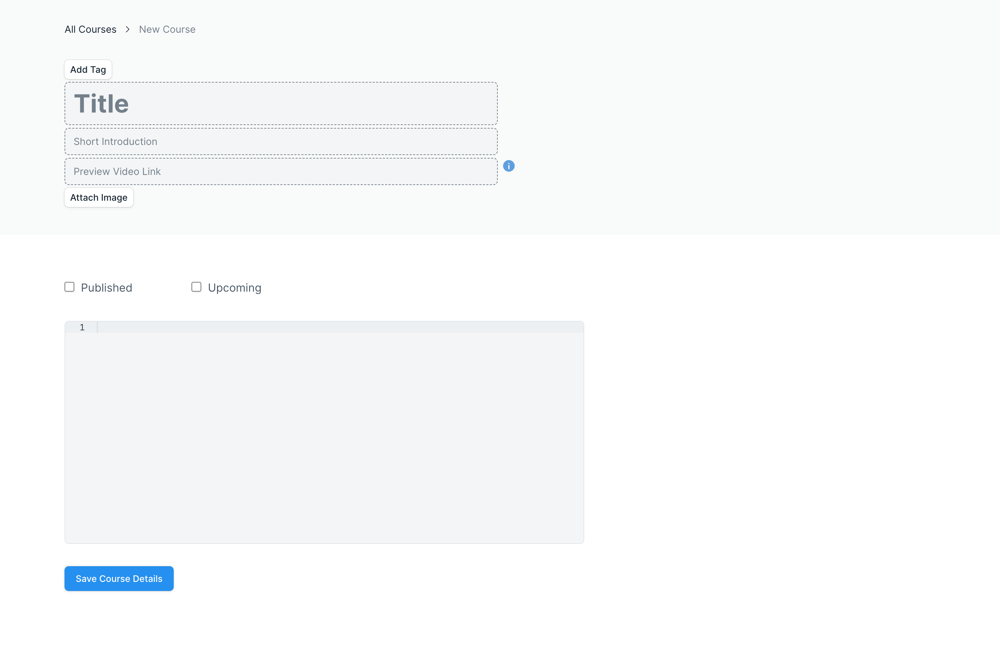
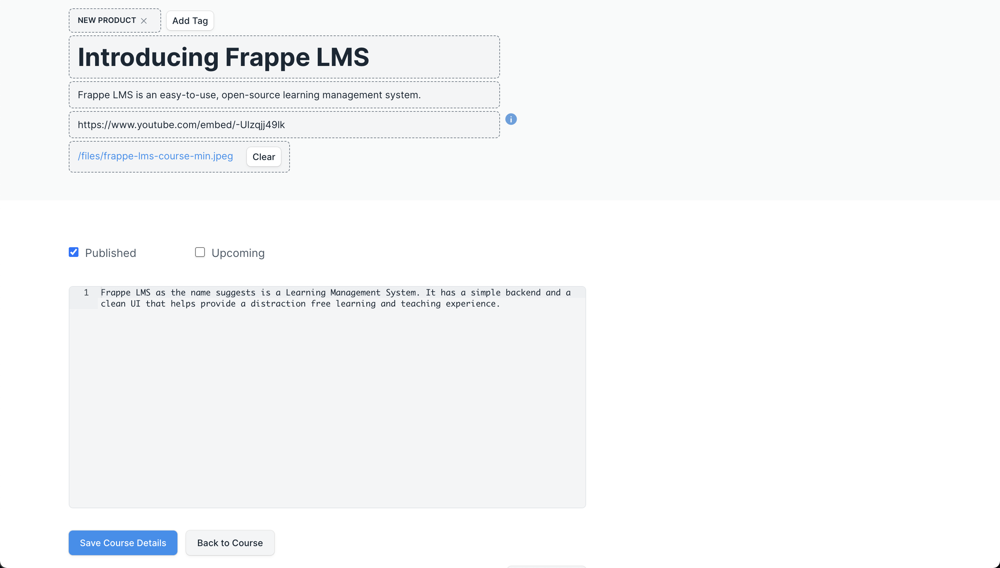

# Course

A course is the primary entity of an LMS. This is the structure that a course in Frappe LMS follows. A course contains chapters. Chapters contain lessons. The main content of a course resides in the lesson. Chapters are used to group similar lessons.

## Create a Course

From the workspace, when you visit the portal, you will land on the Course List page. This page has various sections like Live, Upcoming, Enrolled, etc. But there is no information in them. Because you have done any activity on the LMS yet.

You can click on the **Create a Course** button to create your very first course. You will be redirected to a new page that has a form.

Fill out the form with the following details:

 - **Title:** Give your course an appropriate title.
 - **Tag:** Add relevant tags that will help users decide if this is the right course for them. A tag can indicate the difficulty level of a course, any prerequisites the course has, etc.
 - **Short Introduction:** A brief line describing what the course is about.
 - **Preview Video Link:** A preview video will provide a teaser of the course. To add a preview video follow the steps mentioned [here](../miscellaneous/faq.md#how-to-add-youtube-video-in-a-lesson-or-for-course-preview).
 - **Image:** Attach an image that is relevant to your course.
 - **Publish:** A course will appear on the website to the users only when it is published. This setting is only visible to Course Moderators.
 - **Upcoming:** If a course is about to become available to users soon but not yet, mark it as Upcoming. Note that even for an upcoming course to be visible on the website, it should be published. This setting is also only visible to Course Moderators.
 - **Description:** Add a detailed description about your course to help users know what your course will actually comprise.

 After adding all this information. You can save the course.

 