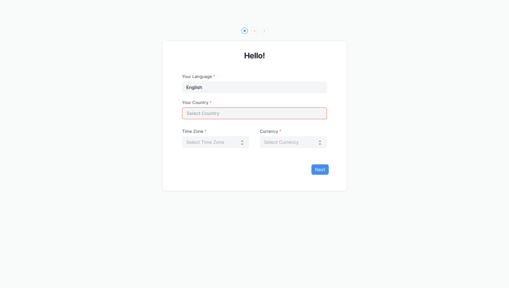
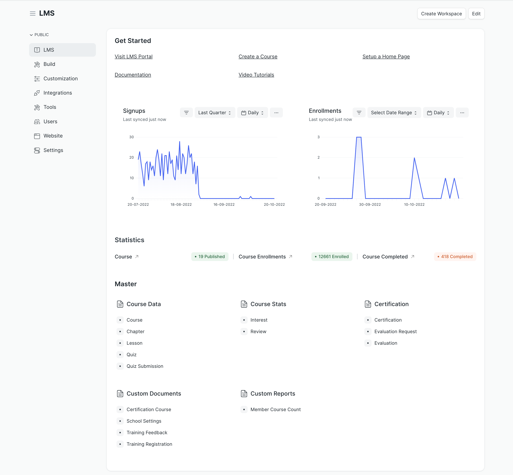

# Setup your account

Once you have installed LMS, you will need to set up your account. Visit your newly created site that has LMS installed, and you should see a setup wizard.

To complete the setup you will need to enter basic information like your country, name, email, and password. Make sure to remember your email and password as this is going to be your admin account.

Once you complete the setup wizard, you will be redirected to the workspace of the LMS. The top section of the workspace provides some important quick links. You can visit the LMS Portal and start setting up your very first course.

The workspace also has some important charts. They show the count of daily signups and enrollments on the LMS.

