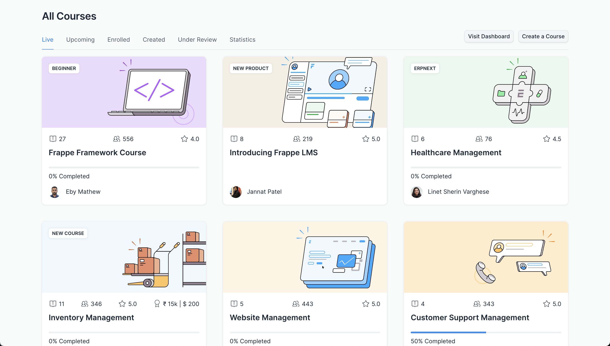

# Introduction

Frappe LMS is an easy-to-use, open-source Learning Management System. It helps you set up your own learning platform. You can create courses and share them with your target audience. The lessons in your course can be in the form of text, videos, quizzes, or even assignments.

If you are a school or college, aiming to provide the best online learning experience to your students, or you are an organization that wants to have a smooth online employee onboarding, Frappe LMS will help you achieve your needs.

Want to check out some existing sites that work on Frappe LMS? Below is a list of some platforms that are powered by Frappe LMS:

 - [Frappe School](https://frappe.school/courses)
 - [Mon School](https://mon.school/courses)
 - [Tinkerhub](https://tinkerhub.frappe.cloud/courses)

 ## Get Started

 - [Setup your account](./get-started/setup-your-account.md)
 - [Create a Course](./get-started/create-a-course.md)
 - [Add a Chapter](./get-started//add-a-chapter.md)
 - [Add a Lesson](./get-started/add-a-lesson.md)